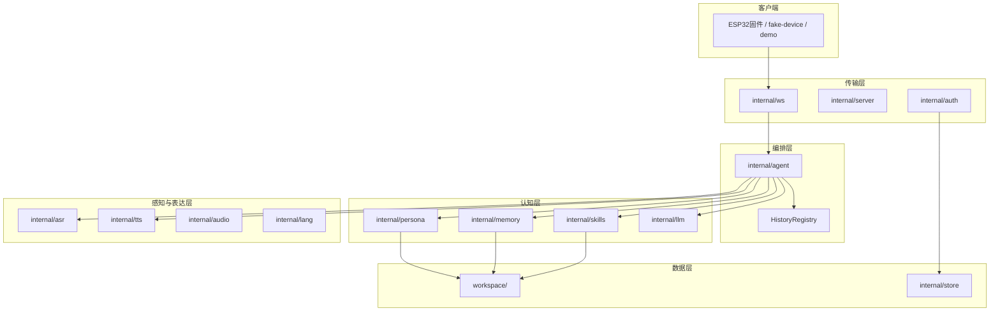
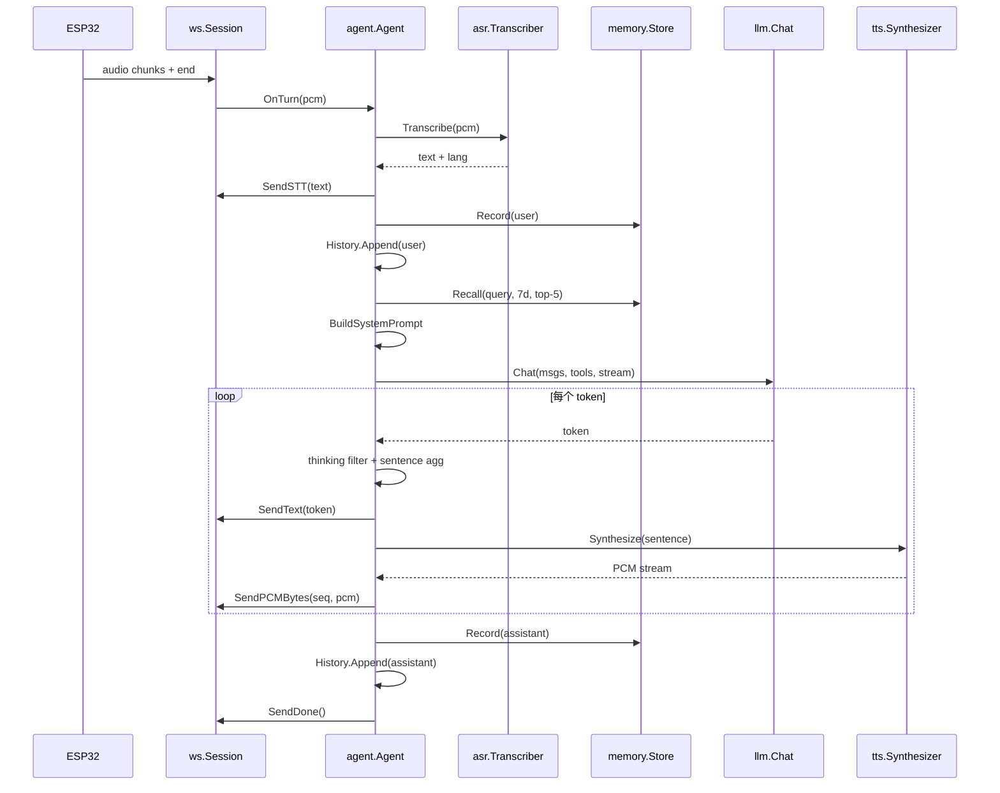
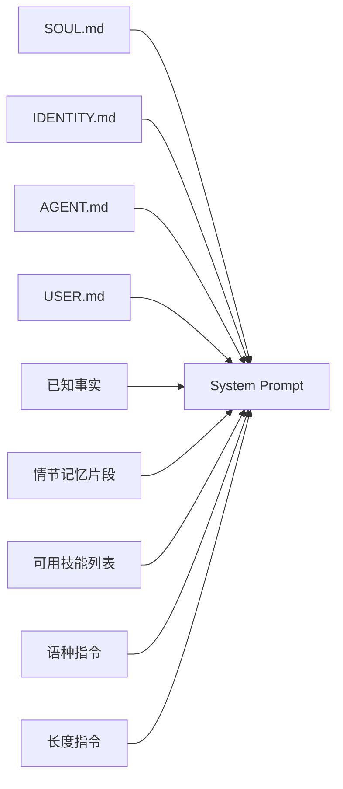

# tiny-bot-cloud-agent 架构说明

> 最后更新：2026-07-13

本文档解释 cloud-agent 的整体架构：各模块负责什么、数据如何流转、人设/记忆/技能如何工作，以及你可以如何扩展系统。

适合读者：想理解系统、想改人设、想加技能、想接新 Provider 的开发者。

---

## 1. 系统定位

**tiny-bot-cloud-agent** 是 [ai-tiny-bot](../../) 陪伴机器人的云端 Agent 服务，用 Go 编写，为 ESP32 固件提供语音对话能力。

| 维度 | 说明 |
|------|------|
| 客户端 | ESP32 固件（`../tiny-bot-firmware/`）、`tools/fake-device` 模拟器、`demo/` 浏览器调试器 |
| 传输 | WebSocket `ws://<host>:5678/ws`，双向原始 PCM |
| 音频格式 | 16 kHz / 16 bit / mono（固件 I2S 直放，无需解码器） |
| 目标部署 | 2 vCPU / 2 GB RAM VPS，单二进制 ~15 MB，docker-compose 优先 |
| 核心链路 | **PCM 上行 → ASR → LLM 流式 → 句子切分 → TTS → PCM 下行** |

一句话概括：云端收到用户说完的一句话，转成文字，结合人设和记忆让 LLM 生成回复，再合成语音发回设备。

---

## 2. 整体架构



### 分层职责

| 层 | 包 | 做什么 |
|----|-----|--------|
| **传输层** | `internal/ws`, `internal/server`, `internal/auth` | HTTP 路由、WebSocket 协议、设备鉴权 |
| **编排层** | `internal/agent` | 把 ASR/LLM/TTS/人设/记忆/技能串成一轮对话（Turn） |
| **认知层** | `internal/persona`, `internal/memory`, `internal/skills`, `internal/llm` | 决定「它是谁、记得什么、会什么、怎么思考」 |
| **感知/表达层** | `internal/asr`, `internal/tts`, `internal/audio`, `internal/lang` | 听、说、切句、检语种 |
| **数据层** | `workspace/`, `internal/store` | 人设/记忆/技能文件 + SQLite 设备数据 |

### 目录结构

```
tiny-bot-cloud-agent/
├── cmd/
│   ├── tiny-bot-cloud-agent/main.go   # 主服务入口
│   ├── seed/main.go                   # 初始化 SQLite 用户/设备
│   ├── echo-agent/main.go             # 文本 pipeline 自检
│   └── asr-test / llm-test / tts-test # 各 Provider 独立调试
├── tools/fake-device/                 # 模拟 ESP32 WebSocket 客户端
├── internal/                          # 业务包（见下文模块表）
├── workspace/                         # 运行时数据
│   ├── SOUL.md, IDENTITY.md, AGENT.md, USER.md
│   ├── memory/<device_id>/YYYY-MM-DD.md
│   ├── memory/<device_id>/facts.md
│   └── skills/<name>/SKILL.md + scripts/
├── demo/                              # 浏览器单页调试器
├── deploy/                            # systemd / Caddy / 部署脚本
├── docs/
│   ├── human-docs/                    # 给人看的文档（本文档所在目录）
│   └── firmware-integration/          # 机器可读的 WS/HTTP Schema
└── test/                              # 集成测试
```

### 启动顺序

主进程 `cmd/tiny-bot-cloud-agent/main.go` 按以下顺序初始化：

1. 加载 config（`.env` + 环境变量）
2. 打开 SQLite
3. 加载 persona（SOUL/IDENTITY/AGENT/USER）
4. 初始化 memory（MarkdownStore）
5. 加载 skills（扫描 `workspace/skills/`）
6. 创建 HistoryRegistry（内存对话历史）
7. 按配置构造 ASR / LLM / TTS Provider
8. 启动 HTTP 服务（含 `/ws`）
9. 监听 SIGHUP → 热重载 persona **和** skills（**不**重载 `.env`）
10. 监听 SIGINT/SIGTERM → 优雅退出

---

## 3. 单轮对话（Turn）流程

每一轮对话从用户说完一句话（WebSocket `end` 消息）开始，到服务端发完 TTS 音频并 `done` 结束。



### Turn 的 9 个步骤

实现位于 `internal/agent/agent.go` 的 `Turn()` 方法：

| 步骤 | 操作 | 关键调用 |
|------|------|----------|
| 1 | ASR 转写用户语音 | `a.ASR.Transcribe()` → `send.SendSTT()` |
| 2 | 写入用户记忆 | `a.Memory.Record(deviceID, "user", userText)` |
| 3 | 追加对话历史 | `a.History.Get(deviceID).Append(user msg)` |
| 4 | 召回相关记忆 | `a.Memory.Recall(deviceID, userText, 7, 5)` |
| 5 | 组装 system prompt | `llm.BuildSystemPrompt()` + 语种/长度指令 |
| 6 | LLM 流式生成 | `a.LLM.Chat()` + thinking filter + 句子聚合 |
| 7 | 逐句 TTS 合成 | 单 worker 串行 `synthAndSend()` → `SendPCMBytes` |
| 8 | 写入助手记忆 | `a.Memory.Record(deviceID, "assistant", fullText)` |
| 9 | 结束本轮 | `send.SendDone()` |

### 关键设计决策

- **每 WebSocket 连接一个 Agent 实例**：在 `internal/server/server.go` 的 `handleWS` 中创建，连接断开即销毁。
- **Turn 异步执行**：在 goroutine 中跑，不阻塞 WebSocket read loop。
- **TTS 串行合成**：用 channel + 单 worker，避免多句 PCM chunk 交错下发。
- **对话历史在内存**：`HistoryRegistry` 按 device_id 隔离，服务重启后丢失。

---

## 4. 模块职责一览

各 `internal/` 包的公开接口、依赖与「改代码该动哪」见 **[09-internal-packages.md](09-internal-packages.md)**。下表为速查：

| 包/目录 | 职责 | 关键文件 |
|---------|------|----------|
| `cmd/tiny-bot-cloud-agent` | 启动、依赖注入、SIGHUP 热重载 | `main.go` |
| `internal/server` | HTTP 路由（`/ws`, `/provision`, `/healthz`） | `server.go` |
| `internal/ws` | WebSocket 协议、Session 状态机 | `session.go`, `protocol.go` |
| `internal/agent` | Turn 编排，组合所有依赖 | `agent.go`, `history.go` |
| `internal/persona` | 加载 SOUL/IDENTITY/AGENT/USER | `persona.go` |
| `internal/memory` | Markdown 长期记忆读写与召回 | `memory.go`, `markdown.go`, `recall.go` |
| `internal/skills` | SKILL.md 加载、注册、脚本执行 | `loader.go`, `registry.go`, `runner.go` |
| `internal/llm` | LLM 抽象、prompt 组装、thinking 过滤 | `llm.go`, `prompt.go`, `openai_compat.go` |
| `internal/asr` | 语音转文字（可插拔 provider） | `asr.go`, `aliyun.go`, `mock.go` |
| `internal/tts` | 文字转语音（可插拔 provider） | `tts.go`, `minimax.go`, `aliyun.go` |
| `internal/audio` | PCM 编解码、句子聚合 | `pcm.go`, `sentence.go` |
| `internal/lang` | 语种检测（zh / yue / en） | `detect.go` |
| `internal/auth` | 设备配网、token 校验 | `auth.go` |
| `internal/store` | SQLite 持久化 | `store.go`, `schema.sql` |
| `internal/config` / `logging` / `aliyunauth` | 配置、日志、阿里云鉴权 | 见 09 文档 |
| `workspace/` | 运行时数据：人设、记忆、技能 | `SOUL.md` 等 |

---

## 5. 人设体系（SOUL / IDENTITY / AGENT / USER）

### 5.1 没有独立的 Soul 包

代码里没有 `internal/soul` 包。**Soul（灵魂）是人设四层模型的第一层**，对应 `workspace/SOUL.md`，由 `internal/persona` 统一加载和管理。

四层文件共同决定 Agent「是谁、怎么说话、面对谁」：

| 文件 | 角色 | 控制什么 | 现有示例 |
|------|------|----------|----------|
| **SOUL.md** | 灵魂 / 性格 | 声音、语气、性格基调、话题边界 | 名字「艾希」、温热住家管家、大人简洁/小孩软一点、实事求是、不主动提 AI |
| **IDENTITY.md** | 身份 | 它是什么、能做什么、不能做什么 | 家里管家（ESP32 盒子）、能聊天/记事/查天气、没 skill 不假装能做 |
| **AGENT.md** | 行为规则 | 怎么说话、何时停、工具/记忆策略 | 日常 1-2 句、讲故事 3-8 句、必要才调工具、不知就直说 |
| **USER.md** | 用户画像 | 默认家庭画像 | 一家子（大人+小孩）、务实短答、可被设备 `user_md` 覆盖 |

### 5.2 四层各自写什么

**SOUL.md** — 决定「听起来像谁」：

- 名字、形象、声音特质
- 语气规则（短句、口语；大人简洁 / 小孩软一点）
- 实事求是与身份口径（不主动提 AI）
- 话题边界（不讨论什么、如何退场）

**IDENTITY.md** — 决定「它知道自己是什么」：

- 角色与物理形态（住家管家，住在 ESP32 盒子里）
- 能力清单（聊天、记事、查天气……）
- 能力边界（没 skill 不假装能做；重大决定找家长）

**AGENT.md** — 决定「它怎么行动」：

- 回复长度策略（闲聊 1-2 句 vs 讲故事 3-8 句）
- 工具调用时机（用户明确要查天气才调，不主动）
- 记忆策略（用户说「记住 XXX」才存；对不上就承认）
- 出错处理（听不清、不会、网络问题）

**USER.md** — 决定「它面对谁」：

- 称呼、家庭对象、关系
- 偏好（喜欢什么、不喜欢什么）

### 5.3 注入 LLM 的方式

`internal/llm/prompt.go` 的 `BuildSystemPrompt()` 按固定顺序拼接：



拼接顺序：

```
SOUL → IDENTITY → AGENT → USER → 已知事实 → 情节记忆片段 → 技能列表 → 语种指令 → 长度指令
```

其中 SOUL / IDENTITY / AGENT / USER 四段在跨 turn 之间是静态的，有利于 LLM Provider 的 prompt 缓存。

运行时还会追加两条动态指令：

- **语种指令**（`LanguageDirective`）：根据 ASR 结果或文本检测，要求用普通话/粤语/英语回复
- **长度指令**（`LengthDirective`）：根据用户词检测短答/长答模式（如用户说「详细」「继续」则允许更长回复）

### 5.4 加载与热重载

- **启动加载**：`persona.NewReloader(workspaceRoot)` 读取四个 Markdown 文件，四个文件缺一不可
- **热重载**：`kill -HUP <pid>` 触发 `persona.Reloader.Reload()` **和** `skills.Reloader.Reload()`，失败时保留旧值，服务不中断
- **不重载的内容**：`.env` / 进程配置——改 Provider、端口、密钥必须重启服务

### 5.5 已知缺口与覆盖

- ~~`users.user_md` 未接入~~ **已接入**：`agent.resolveUserMD` 覆盖 USER 段
- **`users.soul_md`**：对话可通过 `persona.save_soul` 写入；`resolveSoulMD` 覆盖 SOUL 段（不改 workspace 文件，避免 deploy 冲掉、多设备互踩）
- IDENTITY / AGENT 首期仍只读 workspace，不可对话改写
- 热重载 workspace 人设仍用 `kill -HUP`；DB 覆盖不需要 HUP，下轮 Turn 即生效

---

## 6. Memory 模块

### 6.1 设计原则

Memory 提供 Agent 的**长期记忆**能力，设计目标是轻量、无外部依赖、适合低配 VPS。拆成两层：

| 层 | 路径 | 作用 | 时效 |
|----|------|------|------|
| **情节日志** | `workspace/memory/<device_id>/YYYY-MM-DD.md` | 每轮对话原文 | 召回受 `lookbackDays` 约束 |
| **事实巩固** | `workspace/memory/<device_id>/facts.md` | 重要要点（偏好、禁忌等） | **不受 lookback 限制**，始终可注入 prompt |

- **无向量库**：情节召回用关键词匹配 + 时间衰减打分，不引入 embedding 服务
- **接口抽象**：`memory.Store` 接口，当前实现为 `MarkdownStore`，可替换

### 6.2 情节日志格式

```markdown
# 2026-07-11
15:04:05 [user] 今天天气怎么样
15:04:12 [assistant] 今天杭州晴天，25度。
```

- 第一行是日期标题
- 之后每行：`HH:MM:SS [kind] content`
- `kind` 为 `user` / `assistant` / `system`

### 6.2b 事实层格式

```markdown
# Facts
- [2026-07-16] 小主人喜欢恐龙
- [2026-07-16] 睡觉前要听故事
```

- 一行一条；`memory.save` 写入此处（不再写入当日日志的 `[system]` 行）
- 规范化全文去重；超出 `TB_AGENT_FACTS_MAX`（默认 80）删最旧

### 6.3 写入时机

在 `agent.Turn` 中：

1. ASR 完成后，立即写入用户说的话到情节日志（`Record(user)`）
2. LLM 回复完成后，写入完整助手回复（`Record(assistant)`）
3. 若 LLM 调用 `memory.save`，写入事实层（`SaveFact`）

情节文件不存在时自动创建目录和文件，追加写入。

### 6.4 召回与注入

**情节召回**（`internal/memory/recall.go`）：

**分词**（`tokenize`）：
- 中文：按单字切分
- 英文/数字：≥2 字符的词

**打分**（`scoreLine`）：
- 关键词重合度 × **0.6**
- 时间衰减（30 天线性衰减）× **0.4**

**流程**（`MarkdownStore.Recall`）：
1. 若注入了 `MemorySearcher`（生产路径为 SQLite `memory_index`）：按 query 关键词取候选行，只对这些行打分
2. 索引未注入、查询失败或命中为空时：扫描 `workspace/memory/<device_id>/` 下最近 N 天的日期 `.md`（不含 `facts.md`）
3. 对候选行计算相关度分数，排序取 top-K
4. 注入 system prompt 的 `## 历史记忆片段（按相关度）` 段

**事实注入**：每轮 `ListFacts` → system prompt 的 `## 已知事实` 段（在情节片段之前）。

配置项：`TB_AGENT_MEMORY_LOOKBACK_DAYS` / `TB_AGENT_MEMORY_RECALL_K` / `TB_AGENT_FACTS_MAX`（默认 7 / 5 / 80）。  
**注意**：lookback **只约束情节召回**；磁盘上的按天文件不会因过期自动删除。

### 6.5 History / 情节 / 事实：三种「记忆」

| | History（对话历史） | 情节日志 | 事实巩固 |
|--|---------------------|----------|----------|
| 存储 | 内存 ring buffer | 按天 Markdown | `facts.md` |
| 范围 | 最近 N 轮完整对话（默认 20 轮） | lookback 内关键词 Top-K | 最多 FactsMax 条，始终注入 |
| 生命周期 | 重启后可从 SQLite 恢复 | 永久保留 | 永久保留（超限裁旧） |
| 用途 | 维持当前会话上下文 | 近几天聊过什么 | 跨周重要要点 |
| 包 | `internal/agent/history.go` | `internal/memory/` | `internal/memory/` |

举例：用户说「记住我喜欢恐龙」→ `memory.save` 写入 `facts.md`；即使超过 lookback 天数，之后问「我喜欢什么」仍能从「已知事实」答对。近几天闲聊原文仍走情节召回。

### 6.6 已知缺口

- ~~SQLite `memory_index` 表未同步~~ **已接入**：`MarkdownStore.Record` 同步 `IndexMemoryLine`；`Recall` 优先 `MemorySearchQuery` 候选行，无命中再扫文件
- ~~`memory.save` / `memory.recall` 工具尚未实现~~ **已实现**：agent 每轮注册为内置工具；`save` 写事实层，`recall` 搜情节日志
- 异步「梦境」巩固（扫日志抽事实）为二期，首期仅显式 `memory.save`

---

## 7. Skill 模块

### 7.1 什么是 Skill

Skill 是 Agent 的**可调用能力**，以目录 + Markdown + 脚本的形式组织。每个 skill 对应一个外部能力（查天气、讲笑话、控制设备等）。

### 7.2 目录约定

```
workspace/skills/<name>/
├── SKILL.md          # YAML frontmatter + 说明正文
├── scripts/run.sh    # 默认执行脚本（stdin JSON → stdout 结果）
├── references/       # 可选参考文本
└── assets/           # 可选静态资源
```

### 7.3 SKILL.md 格式

```markdown
---
name: weather
description: 查询某城市的实时天气。返回 1 行简短结果。
parameters:
  city:
    type: string
    description: 城市名，例如"杭州"
    required: true
script: scripts/run.sh
---

# Weather skill

读 stdin 收到的 JSON，取 `city` 字段，返回 1 行字符串。
```

frontmatter 字段：

| 字段 | 含义 |
|------|------|
| `name` | 技能名，LLM tool 的 function name |
| `description` | 技能描述，告诉 LLM 什么时候该用 |
| `parameters` | 参数 schema（类似 OpenAI function parameters） |
| `script` | 相对 skill 目录的执行脚本路径 |

### 7.4 加载与注册

启动时 `skills.LoadFromDir(workspaceRoot)`：

1. 扫描 `workspace/skills/*/` 目录
2. 解析每个 `SKILL.md` 的 YAML frontmatter
3. 注册到 `Registry`（name → Skill 查找表）
4. `Registry.ToolDefs()` 转为 `llm.ToolDef[]`，供 LLM API 使用

关键类型：

- `Skill`（`loader.go`）：Name, Description, Parameters, Script, Body, Dir
- `Registry`（`registry.go`）：线程安全的 name → Skill 映射
- `Run()`（`runner.go`）：在 skill 目录下执行脚本，5 秒超时，stdout 截断 8 KB

### 7.5 当前状态（Tool calling 已闭环）

| 能力 | 状态 |
|------|------|
| SKILL.md 加载与解析 | 已实现 |
| 注册为 LLM tool schema | 已实现 |
| tools 参数传给 LLM API | 已实现 |
| 解析 LLM 返回的 tool_calls | **已实现**（`openai_compat.go` 增量拼接） |
| 调用 `skills.Run()` 执行脚本 | **已实现**（`agent.runToolLoop`） |
| `SendTool()` 通知客户端 | **已实现** |
| `SendStatus()` 静默步骤进度 | **已实现**（tool 前后 `start`/`done|error`，不进 TTS） |
| `memory.save` / `memory.recall` 内置工具 | **已实现** |
| `persona.save_soul` / `persona.save_user` | **已实现**（写 SQLite per-user 覆盖） |
| `code.write` / `code.run` 受限 Python | **已实现**（`workspace/scratch/<device_id>/`，`python3 -I`，超时与清环境） |

### 7.6 添加新 Skill

1. 在 `workspace/skills/<name>/` 创建 `SKILL.md` 和 `scripts/run.sh`
2. **SIGHUP 热重载 skills**（`kill -HUP <pid>`），或重启服务
3. 技能会自动出现在 system prompt 和 LLM tools 列表中

脚本约定：`run.sh` 从 stdin 读 JSON 参数，结果写到 stdout。

---

## 8. 其他关键模块

### 8.1 LLM（`internal/llm`）

| 组件 | 职责 |
|------|------|
| `Chat` 接口 | 统一的 LLM 调用抽象 |
| `BuildSystemPrompt` | 拼接人设 + 记忆 + 技能 |
| `OpenAICompat` | OpenAI 兼容 SSE 流式（MiniMax M3 等） |
| `StreamThinkingFilter` | 剥离 `` / `<think>` 推理块，只展示可见回复 |
| `LengthDirective` | 根据用户词检测短答/长答模式 |
| `mock` | 开发用回显实现 |

### 8.2 TTS（`internal/tts`）

| Provider | 实现 | 协议 |
|----------|------|------|
| `mock` | `mock.go` | 返回固定长度静音 PCM |
| `aliyun` | `aliyun.go` | 阿里云 CosyVoice REST |
| `minimax` | `minimax.go` | WebSocket `wss://api.minimaxi.com/ws/v1/t2a_v2` |

多语种音色路由：`agent.synthAndSend()` 对每句话检测语种 → `VoiceProfiles.VoiceProfileFor(lang)` 选音色。

文本清洗：`tts.CleanText()` 移除 LLM 幻觉出的方括号乱码（如 `[e~[`），在 thinking filter 之后、TTS 之前调用。

### 8.3 ASR（`internal/asr`）

| Provider | 实现 |
|----------|------|
| `mock` | 读 `TB_FAKE_ASR_TEXT` 或返回固定文本 |
| `aliyun` | 阿里云 Paraformer 一句话识别 REST |

音频契约：PCM 16 kHz / 16 bit / mono。

### 8.4 Audio（`internal/audio`）

- `pcm.go`：PCM ↔ base64 转换
- `sentence.go`：`Aggregator` 按句末标点（。！？）或 80 字上限切分，供 TTS 逐句合成

### 8.5 Lang（`internal/lang`）

- `Detect(text)` → `zh` / `yue` / `en`
- 优先级：英语 > 粤语特征词 > 普通话
- 用于：回复语种指令、TTS 音色路由

### 8.6 WebSocket（`internal/ws`）

- `protocol.go`：JSON 消息类型定义（hello / audio / end / stt / text / audio / done / error）
- `session.go`：连接状态机（hello 鉴权 → audio 缓冲 → end 触发 turn）
- 每连接新建 Agent；Turn 在 goroutine 异步执行

### 8.7 Auth + Store（`internal/auth` + `internal/store`）

- `POST /provision?device_id=&code=` → 签发 32 字节 hex token
- WS hello 时 SHA-256 比对 `devices.token_hash`
- SQLite 表：`users`, `devices`, `conversations`, `messages`, `memory_index`
- **当前实际使用**：主要是 `users` + `devices`（鉴权）；`conversations` / `messages` 表已建但 agent 未写入

---

## 9. 配置与数据目录

### 配置源

单一配置源，加载优先级：**进程环境变量 > `.env` 文件 > 代码 defaults**

实现：`internal/config/config.go`，模板：`.env.example`

### 关键环境变量

| 变量 | 默认 | 含义 |
|------|------|------|
| `TB_AGENT_ADDR` | `:5678` | HTTP 监听地址 |
| `TB_DB_PATH` | `./data/tiny-bot.db` | SQLite 路径 |
| `TB_WORKSPACE_ROOT` | `./workspace` | 人设/记忆/技能根目录 |
| `TB_PROVIDER_ASR` | `mock` | ASR Provider |
| `TB_PROVIDER_LLM` | `mock` | LLM Provider |
| `TB_PROVIDER_TTS` | `mock` | TTS Provider |
| `TB_OPENAI_COMPAT_*` | — | LLM 配置（MiniMax/OpenAI 等） |
| `TB_ALIYUN_*` | — | 阿里云 ASR/TTS |
| `TB_MINIMAX_TTS_*` | — | MiniMax TTS 音色/模型 |
| `TB_AGENT_MAX_RESPONSE_CHARS` | `600` | 回复字符上限 |
| `TB_AGENT_HISTORY_TURNS` | `20` | 内存对话轮数 |
| `TB_AGENT_MEMORY_RECALL_K` | `5` | 情节记忆召回条数 |
| `TB_AGENT_MEMORY_LOOKBACK_DAYS` | `7` | 情节记忆回溯天数（不约束事实层） |
| `TB_AGENT_FACTS_MAX` | `80` | 巩固事实条数上限 |
| `TB_AGENT_TURN_TIMEOUT` | `120s` | 单轮 turn 超时（含多步 tool） |
| `TB_AGENT_MAX_TOOL_ROUNDS` | `8` | tool 循环最大轮数 |
| `TB_CODE_RUN_TIMEOUT` | `15s` | `code.run` 超时 |
| `TB_CODE_PYTHON_BIN` | `python3` | Python 解释器路径 |
| `TB_AGENT_DAILY_TOKEN_CAP` | `200000` | 每设备日 token 上限（in+out）；`0` = 不限制 |

### workspace 数据目录

```
workspace/
├── SOUL.md              # 人设：灵魂/性格
├── IDENTITY.md          # 人设：身份/能力
├── AGENT.md             # 人设：行为规则
├── USER.md              # 人设：默认用户画像
├── memory/
│   └── <device_id>/
│       ├── 2026-07-11.md
│       └── 2026-07-12.md
└── skills/
    └── example-weather/
        ├── SKILL.md
        └── scripts/run.sh
```

docker-compose 部署时 `workspace/` **可写挂载**（情节日志 / `facts.md`）；entrypoint 会 `chown` 给 `tinybot`。发版时线上已有 workspace 文件优先保留，包内仅追加缺失路径（见 `deploy/update-tiny-bot-cloud-agent.sh`）。

---

## 10. 如何扩展

### 10.1 无需改代码（内容/运维扩展）

| 操作 | 方式 | 生效方式 |
|------|------|----------|
| 修改人设 | 编辑 `workspace/SOUL.md` 等四文件，或打开 `/demo/workspace.html`（需 `TB_WORKSPACE_EDITOR_TOKEN`） | 保存人设文件会 `Persona.Reload`；也可 `kill -HUP` |
| 添加技能 | 新建 `workspace/skills/<name>/` | **重启服务** |
| 查看记忆 | 直接读 `workspace/memory/<device_id>/` 下的 `.md`，或 Workspace 编辑页 | 自动增长，无需维护 |
| 切换 Provider | 改 `.env` 中 `TB_PROVIDER_*` | 重启服务 |
| 添加设备 | `bin/seed -device-id xxx -pairing-code yyy` | 立即生效 |

### 10.2 实现接口（Provider 扩展）

新增 ASR / LLM / TTS Provider 只需实现对应接口并在 `main.go` 的 `buildASR()` / `buildLLM()` / `buildTTS()` 中注册：

```
internal/asr/asr.go     → Transcriber 接口
internal/llm/llm.go     → Chat 接口
internal/tts/tts.go     → Synthesizer 接口
internal/memory/memory.go → Store 接口
```

步骤：
1. 在对应 `internal/` 包下新建实现文件
2. 实现接口的所有方法
3. 在 `cmd/tiny-bot-cloud-agent/main.go` 的 build 函数中加 switch case
4. 在 `.env.example` 中补充相关配置项

### 10.3 架构级扩展（需改 agent 核心）

| 扩展方向 | 改动位置 | 说明 |
|----------|----------|------|
| **Tool calling 闭环** | `agent.Turn` + `openai_compat.go` | 解析 `tool_calls` → `skills.Run()` → 回填 tool message → 二次 LLM |
| **per-device 用户画像** | `agent.Turn` | 读 `store.GetUser(device.UserID).UserMD` 覆盖 USER 段 |
| **对话持久化** | `store/conversations.go` + `agent.Turn` | turn 前后写入 SQLite conversations/messages |
| **记忆索引加速** | `memory/markdown.go` + `store.MemorySearchQuery` | Record 写索引；Recall 先按关键词过滤候选再打分 |
| **向量记忆** | 新 `Store` 实现 | 替换关键词召回为 embedding 检索 |
| **Token 日限额** | `agent.Turn` | 使用 `cfg.Agent.DailyTokenCapPerDevice` |
| **精细打断** | `agent.Bind` + context cancel | interrupt 时取消 LLM/TTS goroutine |
| **Skills 热重载** | `main.go` SIGHUP handler | **已实现**：与 persona 一并 `Reload()`，不重载 `.env` |
| **配置项接入** | `agent.Turn` | 用 `cfg.Agent.MemoryRecallK/LookbackDays` 替换硬编码 `7, 5` |
| **内置 memory 工具** | `internal/skills/` 或 agent 内置 | 实现 `memory.save` / `memory.recall` 作为内置 tool |
| **新 HTTP 端点** | `internal/server/server.go` | 如管理后台、记忆浏览 API |
| **多 Agent 人设** | `persona` + `workspace/` | 按 device 或 user 加载不同 SOUL/IDENTITY 文件 |

### 10.4 推荐扩展路径

如果你刚开始扩展，建议按这个顺序：

1. **改人设文件** — 零代码，立刻改变 Agent 性格和行为
2. **接真实 Provider** — 把 ASR/LLM/TTS 从 mock 切到阿里云/MiniMax
3. **添加 Skill 目录** — 即使 tool calling 未闭环，文字描述已能影响 LLM 行为
4. **实现 Tool calling 闭环** — 让技能真正可执行，收益最大
5. **per-device 用户画像** — 多设备/多用户场景必需
6. **对话持久化** — 服务重启不丢上下文

---

## 11. 相关文档

| 文档 | 路径 | 内容 |
|------|------|------|
| 数据库设计 | [01-database.md](01-database.md) | SQLite 表结构、存储策略 |
| 固件对接 | [02-firmware-integration.md](02-firmware-integration.md) | ESP32 如何连 WebSocket |
| internal 包手册 | [09-internal-packages.md](09-internal-packages.md) | 各 Go 包职责、接口、依赖 |
| 部署指南 | [05-deployment.md](05-deployment.md) | VPS docker-compose 部署 |
| WS JSON Schema | [../firmware-integration/ws-protocol.schema.json](../firmware-integration/ws-protocol.schema.json) | 机器可读协议 |
| HTTP OpenAPI | [../firmware-integration/http-api.openapi.yaml](../firmware-integration/http-api.openapi.yaml) | HTTP 端点定义 |
| 项目规范 | [../../CLAUDE.md](../../CLAUDE.md) | 命名约定、配置原则 |
| 快速开始 | [../../README.md](../../README.md) | 构建、运行、调试 |

---

## 附录：v1 已知限制汇总

> 2026-07-16 更新：下列缺口已在本轮扩展中补齐。保留本表作历史对照。

| 限制 | 状态 | 实现位置 |
|------|------|----------|
| Tool calling 未闭环 | **已实现** | `openai_compat` 解析 tool_calls + `agent.runToolLoop` |
| `user_md` 未接入 | **已实现** | `agent.resolveUserMD` 覆盖 USER 段 |
| 对话未持久化到 SQLite | **已实现** | Turn 写 messages；hello 时恢复 History |
| `memory_index` 未接入 | **已实现** | Record 同步索引；Recall 优先按关键词过滤候选 |
| 记忆参数硬编码 | **已实现** | `AgentCfg.MemoryLookbackDays/RecallK` |
| Token 日限额未强制 | **已实现** | Turn 开头 `SumDeviceTokensToday` |
| Interrupt 未精细取消 | **已实现** | session `turnCancel` |
| SIGHUP 不重载 skills | **已实现** | `skills.Reloader` + main SIGHUP |
