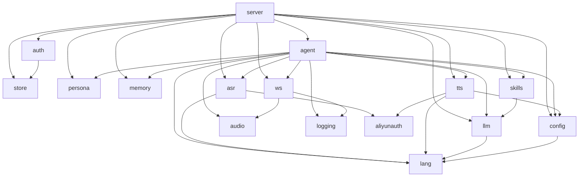

# internal 包说明

> 最后更新：2026-07-16

本文档按包说明 `internal/` 下每个 Go 模块的职责、公开接口、依赖关系与当前限制。  
整体架构与 Turn 流程见 [00-architecture.md](00-architecture.md)；数据库表结构见 [01-database.md](01-database.md)。

---

## 1. 包总览

| 包 | 一句话职责 | 主文件 |
|----|------------|--------|
| [`config`](#config) | 加载 `.env` / 环境变量并校验 | `config.go` |
| [`logging`](#logging) | 配置 slog，按 device 挂上下文 | `logging.go` |
| [`store`](#store) | SQLite 连接与仓储 | `store.go`, `schema.sql` |
| [`auth`](#auth) | 配网签发 token、hello 校验 | `auth.go` |
| [`server`](#server) | HTTP 路由与依赖注入入口 | `server.go` |
| [`ws`](#ws) | WebSocket 协议与 Session 状态机 | `protocol.go`, `session.go` |
| [`agent`](#agent) | 一轮对话（Turn）编排 | `agent.go`, `history.go` |
| [`persona`](#persona) | 加载 SOUL/IDENTITY/AGENT/USER | `persona.go` |
| [`memory`](#memory) | Markdown 长期记忆读写与召回 | `memory.go`, `markdown.go`, `recall.go` |
| [`skills`](#skills) | 技能加载、注册、脚本执行 | `loader.go`, `registry.go`, `runner.go` |
| [`codejail`](#codejail) | 设备 scratch 下受限写/跑 Python | `jail.go` |
| [`llm`](#llm) | LLM 抽象、prompt、thinking 过滤 | `llm.go`, `prompt.go`, `openai_compat.go` |
| [`asr`](#asr) | 语音转文字 | `asr.go`, `aliyun.go`, `mock.go` |
| [`tts`](#tts) | 文字转语音 | `tts.go`, `minimax.go`, `aliyun.go` |
| [`audio`](#audio) | PCM 工具与句子聚合 | `pcm.go`, `sentence.go`, `wav.go` |
| [`lang`](#lang) | 文本语种检测 zh/yue/en | `detect.go` |
| [`aliyunauth`](#aliyunauth) | 阿里云签名与 NLS Token | `sign.go`, `token.go` |

### 依赖关系



读代码时建议顺序：`config` → `server` / `ws` → `agent` → `persona` / `memory` / `skills` → `asr` / `llm` / `tts`。

---

## 2. 基础设施

### config

**职责**：单一配置源。优先级为进程环境变量 > `.env` > 代码默认值。

**关键类型**：

| 类型 | 作用 |
|------|------|
| `Config` | 总配置：Server / Storage / Providers / OpenAICompat / Aliyun / MiniMax / Agent / Logging |
| `VoiceProfile` | 单语种 TTS 音色（voice_id + language_boost 等） |
| `MiniMaxConfig` | MiniMax TTS/LLM 相关；`VoiceProfileFor(lang)` 按语种选音色 |

**关键函数**：`Load`、`(*Config).Validate`、`(*Config).SafeView`（脱敏，供 `GET /config`）。

**注意**：`Load` 的 string 参数已废弃（兼容旧 `-config`）；改配置需重启进程（SIGHUP 不重载 `.env`）。

---

### logging

**职责**：封装 `log/slog`，支持 JSON/text；把 `device_id` 挂到 context，方便按设备查日志。

**关键函数**：`Setup`、`SetupWithWriter`、`WithDevice`、`FromContext`。

**注意**：无业务状态；agent / ws 在 hello 与 turn 路径里会注入 device。

---

### store

**职责**：SQLite（`modernc.org/sqlite`，无 CGo，WAL）连接、迁移与 CRUD。

**关键类型**：`Store`、`User`、`Device`、`Conversation`、`Message`、`MemoryHit`。

**主要能力**：

| 区域 | 函数示例 | 主路径是否使用 |
|------|----------|----------------|
| 用户/设备 | `CreateUser`、`BindDevice`、`GetDevice`、`ReBindDevice`、`UpdateUserMD`、`UpdateSoulMD` | ✅ auth + per-user `user_md` / `soul_md` |
| 会话/消息 | `OpenConversation`、`AppendMessage`、`ListRecentMessages`、`SumDeviceTokensToday` | ✅ agent Turn 写入与恢复 |
| 记忆索引 | `IndexMemoryLine`、`MemorySearch` | ✅ `MarkdownStore.Record` 同步写入 |

**注意**：设备鉴权与对话持久化都走这里；长期记忆仍以 Markdown 为主路径。`memory_index` 在 `Record` 时写入，并经 `MemorySearchQuery` 给 `Recall` 缩候选。表设计细节见 [01-database.md](01-database.md)。

---

### auth

**职责**：首次配网（pairing code → 长期 token）与 WebSocket hello 时校验。

**关键类型**：`Service`；错误 `ErrNotFound` / `ErrInvalidCode` / `ErrInvalidToken` / `ErrAlreadyBound`。

**关键函数**：

- `Provision(ctx, deviceID, code, force)`：签发 token；`force=true` 可对已绑定设备重发
- `VerifyToken(ctx, deviceID, token)`：hello 时比对 `token_hash`（SHA-256，时序安全）

**依赖**：`store`。

---

## 3. 传输与编排

### server

**职责**：HTTP 入口，组装依赖，为每个 `/ws` 连接创建 `agent.Agent` 并 `Bind`。

**关键类型**：`Deps`（注入 Config / Store / Auth / Persona / Memory / Skills / History / ASR / LLM / TTS）、`Server`。

**端点**：`/ws`、`/provision`、`/healthz`、`/readyz`、`/metrics`、`/config`；可选 `/demo/` 静态页。

**关键函数**：`New`、`ListenAndServe`、`Shutdown`。

**注意**：CORS 当前为 `Access-Control-Allow-Origin: *`（单机自部署够用，生产建议白名单）。

---

### ws

**职责**：WebSocket 升级、JSON 协议、Session 状态机（hello → 收 audio → end 触发 turn）。

**关键类型**：

| 类型 | 作用 |
|------|------|
| `ClientMsg` / `ServerMsg` | 上下行消息体 |
| `Session` | 连接状态；回调 `OnHello` / `OnTurn` / `OnInterrupt` / `OnClose` |

**关键函数**：`Upgrade`、`NewSession`、`(*Session).Run`、`SendSTT` / `SendText` / `SendTool` / `SendStatus` / `SendPCMBytes` / `SendDone`。

**依赖**：`audio`（PCM 编解码）、`logging`。

**注意**：

- Turn 在 goroutine 中异步跑，不阻塞读循环；`interrupt` 调用 `turnCancel` 取消当前 LLM/TTS
- `SendTool` 由 agent 工具循环在执行 skill 前触发
- `SendStatus` 在每个 tool 前后发静默进度（`start` / `done` / `error`），不进 TTS；`Session.TurnTimeout` 由 `TB_AGENT_TURN_TIMEOUT` 注入
- `Upgrade` 不校验 Origin（`InsecureSkipVerify`）；单帧上限约 1 MiB
- 协议字段详见 `docs/firmware-integration/ws-protocol.schema.json`（[03-protocol.md](03-protocol.md) 计划中）

---

### agent

**职责**：把 ASR → 记忆 → 人设 prompt → LLM 流式（含 tool calling）→ 句子切分 → TTS 串成一轮 **Turn**。

**关键类型**：

| 类型 | 作用 |
|------|------|
| `Agent` | 持有 ASR/LLM/TTS/Persona/Memory/Skills/History/Store/AgentCfg/音色表 |
| `Sender` | 回传抽象（`ws.Session` 实现） |
| `History` / `HistoryRegistry` | 按 device 的内存对话 ring buffer（可从 SQLite 恢复） |

**关键函数**：`New`、`(*Agent).Turn`、`(*Agent).Bind`、`NewHistoryRegistry`。

**Turn 要点**（细节见 [00-architecture.md](00-architecture.md) §3）：

1. 日 token 限额检查 → ASR → `SendSTT`
2. `Memory.Record(user)` + SQLite `AppendMessage` + `History.Append`
3. `Memory.ListFacts` + `Memory.Recall`（读 `AgentCfg`）→ `resolveSoulMD` / `resolveUserMD` → `llm.BuildSystemPrompt`
4. `runToolLoop`：解析 `tool_calls` → `SendStatus(start)` → `SendTool` → `skills.Execute`（含 `memory.save`→`SaveFact`、`persona.save_*`→DB、`code.write`/`code.run`→scratch）→ `SendStatus(done|error)` → 二次 LLM
5. 单 worker 串行 TTS → `SendPCMBytes`
6. `Memory.Record(assistant)` + 持久化 → `SendDone`

**注意**：

- 内置工具 `memory.save` / `memory.recall` / `persona.save_soul` / `persona.save_user` 每轮动态注册
- hello 时从 SQLite 恢复 History；断开时 `CloseConversation`

---

## 4. 认知层

### persona

**职责**：从 `workspace/` 加载四层人设 Markdown，支持 SIGHUP 热重载。

**关键类型**：`Persona`（Soul / Identity / Agent / User 字符串）、`Reloader`。

**关键函数**：`Load`、`NewReloader`、`(*Reloader).Get` / `Reload`、`(*Persona).SystemPrompt`。

**注意**：

- 四个文件缺一则启动失败
- Reload 失败保留旧值
- **没有** `internal/soul` 包；SOUL 只是四层中的一层
- SIGHUP 同时重载 persona 与 skills（`.env` 仍需重启）

---

### memory

**职责**：情节日志（按天 Markdown）+ 事实巩固（`facts.md`）；情节用关键词 + 时间衰减召回 Top-K。

**关键类型**：`Store` 接口、`MarkdownStore`、`Snippet`、`Fact`。

**接口**：

```text
Record(ctx, deviceID, kind, content, ts) error
Recall(ctx, deviceID, query, lookbackDays, k) ([]Snippet, error)
SaveFact(ctx, deviceID, content, ts, max) error
ListFacts(ctx, deviceID, max) ([]Fact, error)
TodayPath(deviceID) string
```

**存储路径**：
- 情节：`workspace/memory/<device_id>/YYYY-MM-DD.md`
- 事实：`workspace/memory/<device_id>/facts.md`

**召回**：中文单字 + 英文/数字词；分数 = 关键词重合 × 0.6 + 30 天时间衰减 × 0.4。lookback 只约束情节；事实始终可注入 prompt。

**注意**：与 `agent.History` 不同——History 是近期完整对话（内存），情节是跨天日志片段，事实是跨 lookback 的要点。`memory.save` 写事实层；`memory_index` 随情节 `Record` 同步，且 `Recall` 优先用索引候选（无命中再扫文件）。

---

### skills

**职责**：扫描 `workspace/skills/*/SKILL.md`，注册为 LLM tool schema，执行脚本；支持内置工具与 SIGHUP 热重载。

**关键类型**：`Skill`、`Param`、`Registry`、`Builtin`、`Reloader`、`Result`。

**关键函数**：`Load` / `LoadAll` / `LoadFromDir`、`NewReloader`、`(*Registry).ToolDefs` / `Execute`、`Run`（stdin JSON → stdout，默认 5s 超时、stdout 截断 8KB）。

**依赖**：`llm`（`ToolDef`）。

**注意**：agent 的 `runToolLoop` 会真正调用 `Execute`；内置 `memory.*` 优先于同名脚本 skill。SIGHUP 可热重载 skills 目录。

---

### codejail

**职责**：在 `workspace/scratch/<device_id>/` 下校验文件名、写入 `.py`、用 `python3 -I` 超时执行；显式 Env（不继承 `TB_*`）。

**关键类型**：`Jail`、`RunResult`。

**关键函数**：`ValidateFilename`、`(*Jail).Write` / `Run`。

**依赖**：标准库 `os/exec`。由 agent 内置 `code.write` / `code.run` 调用。

**注意**：非安全沙箱（不断言断网）；仅靠路径约束、stdlib、清密钥与超时。

---

### llm

**职责**：LLM 调用抽象、system prompt 组装、流式 thinking 过滤、回复长度指令、tool_calls 解析。

**关键类型**：

| 类型 | 作用 |
|------|------|
| `Chat` | 流式对话接口（可选 `*StreamResult` 汇总 tool_calls / usage） |
| `Message` / `ToolDef` / `ToolCall` / `OnToken` | 消息与回调 |
| `StreamResult` | 流结束后的 content / tool_calls / finish_reason / tokens |
| `PersonaInputs` | 拼 prompt 的输入（人设四段 + 事实 + 情节记忆 + tools） |
| `OpenAICompat` | OpenAI 兼容 SSE（MiniMax 等） |
| `StreamThinkingFilter` | 剥除 reasoning / `<think>` 块 |
| `Mock` | 开发回显 |

**关键函数**：`BuildSystemPrompt`、`LanguageDirective`、`LengthDirective`、`NewOpenAICompat`、`NewStreamThinkingFilter`。

**Prompt 顺序**：SOUL → IDENTITY → AGENT → USER → 记忆片段 → 技能列表；agent 再追加语种与长度指令。

**注意**：`openai_compat` 解析 `delta.content` 与增量 `tool_calls`，并请求 `stream_options.include_usage`。

---

## 5. 感知与表达

### asr

**职责**：PCM → 文本。音频契约：16 kHz / 16 bit / mono。

**接口**：`Transcriber`（`Transcribe` / `Name`）。

**实现**：`Mock`（可读 `TB_FAKE_ASR_TEXT`）、`Aliyun`（Paraformer 一句话识别 REST + NLS Token）。

**依赖**：`aliyunauth`、`lang`（结果语种可用文本启发式填充）。

---

### tts

**职责**：文本 → PCM 流；按语种选音色；清洗非法控制符。

**接口**：`Synthesizer`（`Synthesize(ctx, text, opts *SynthOptions)`）。

**实现**：`Mock`、`MiniMax`（WebSocket 流式）、`Aliyun`（CosyVoice REST）。

**关键函数**：`CleanText`（剥 `[e~[` 类幻觉标记）、`SynthOptionsFromProfile`。

**依赖**：`config`、`lang`、`aliyunauth`（Aliyun 路径）。

**注意**：Aliyun TTS 仍走 AK/SK `Sign`；NLS Token 迁移在注释中标记为待办。

---

### audio

**职责**：PCM16 字节工具；流式按句切分（句末标点或字数上限），供 TTS 逐句合成。

**关键类型**：`Aggregator`、`PCM16MonoHeader`。

**关键函数**：`NewAggregator` / `Push` / `Flush`、`BytesToPCM16` / `PCM16ToBytes`、`WriteWAV`。

**注意**：v1 仅 16kHz / 16bit / mono。

---

### lang

**职责**：纯文本启发式语种检测，供 LLM 回复语种指令与 TTS 音色路由。

**类型**：`Code`（`Zh` / `Yue` / `En`）。

**函数**：`Detect`、`String`、`Label`。

**优先级**：英语特征 > 粤语特征词 > 默认普通话。非 ML 模型。

---

### aliyunauth

**职责**：阿里云 OpenAPI v3 HMAC-SHA1 签名；NLS `CreateToken` 与缓存刷新。

**关键类型**：`Token`、`TokenManager`、`TokenManagerConfig`。

**关键函数**：`Sign`、`NewTokenManager`、`(*TokenManager).GetToken`、`MetaEndpoint`。

**注意**：ASR 主路径用 Token；`RandomToken` 当前未用；Aliyun TTS 尚未迁到 TokenManager。

---

## 6. 谁调用谁（按调用链）

```text
main
  └─ config.Load
  └─ store.Open
  └─ auth.New
  └─ persona.NewReloader
  └─ memory.NewMarkdownStore
  └─ skills.LoadFromDir
  └─ agent.NewHistoryRegistry
  └─ buildASR / buildLLM / buildTTS
  └─ server.New → ListenAndServe
        └─ /ws → agent.New + Bind
              └─ ws.Session.Run
                    └─ OnTurn → agent.Turn
                          ├─ asr.Transcribe
                          ├─ memory.Record / Recall
                          ├─ persona.Get + skills.ToolDefs
                          ├─ llm.Chat (+ thinking filter)
                          ├─ audio.Aggregator
                          └─ tts.Synthesize → SendPCMBytes
```

---

## 7. 改代码时该动哪

| 你想做的事 | 优先看的包 |
|------------|------------|
| 改性格 / 回复规则 | `persona` + `workspace/*.md`（热重载） |
| 改记忆写入或召回策略 | `memory`；可选接 `store.memory_index` |
| 加可执行技能 / tool calling | `skills` + `llm/openai_compat` + `agent.Turn` |
| 换 ASR / LLM / TTS 厂商 | `asr` / `llm` / `tts` + `main` 的 `build*` |
| 改 WebSocket 消息字段 | `ws/protocol.go` + firmware schema |
| 改配网 / token | `auth` + `store` |
| 改端口、Provider、音色 | `config` + `.env` |
| 改日志格式 / device 字段 | `logging` |
| 改句子切分或 PCM 工具 | `audio` |
| 改语种检测启发式 | `lang` |

---

## 8. 相关文档

| 文档 | 关系 |
|------|------|
| [00-architecture.md](00-architecture.md) | 系统总览、Turn、人设/记忆/技能详解、扩展指南 |
| [01-database.md](01-database.md) | SQLite 表与 store 设计 |
| [02-firmware-integration.md](02-firmware-integration.md) | 固件如何连 ws / provision |
| [07-providers.md](07-providers.md) | Provider 接入（计划中） |
| [../../CLAUDE.md](../../CLAUDE.md) | 项目规范与命名约定 |
